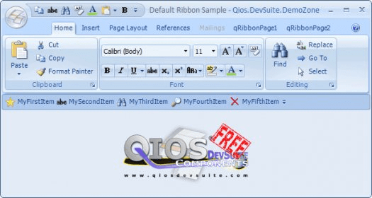

# Qios DevSuite Components

QIOS DevSuite is an advanced .NET control library, that is fully integrated with Visual Studio.NET
and can be used with all .NET languages, such as C#, VB.NET and C .NET.

QIOS DevSuite contains more than 30 advanced controls that make it possible for you to create 
advanced graphical user interfaces. All controls are highly configurable and with great precision.
Furthermore QIOS DevSuite contains a list of great features that make developers work so much easier.



* https://www.nuget.org/packages/Qios.DevSuite.Components/
* https://qios-devsuite-components.software.informer.com/4.0/
* https://sourceforge.net/projects/qiosdevsuite/

## Background
<details>

This would appear to have been a reasonably popular, free set of controls for _WinForms_ development.

Unfortunately, the [company](www.qiosdevsuite,com) behind this component is now defunct.
Technology has moved on and this component is now not compatible with .NET Core.
The source code is not available, so there is no way to make this component compatible.

[JetBrains dotPeek](https://www.jetbrains.com/decompiler/) is a .NET decompiler and assembly browser.
This has allowed us to decompile the component and make it compatible with newer technologies.

</details>

## Breaking changes for migration from .NET Framework to .NET Core
<details>

* https://docs.microsoft.com/en-gb/dotnet/core/compatibility/fx-core#recommended-action

* .NET Core 3.1
  * Removed controls

Starting in .NET Core 3.1, some Windows Forms controls are no longer available.

Each removed control has a recommended replacement control. Refer to the following table:

| Removed control (API) | Recommended replacement | Associated APIs that are removed |
|-----------------------|-------------------------|----------------------------------|
| ContextMenu | ContextMenuStrip ||
| DataGrid | DataGridView | DataGridCell, DataGridRow, DataGridTableCollection, DataGridColumnCollection, DataGridTableStyle, DataGridColumnStyle, DataGridLineStyle, DataGridParentRowsLabel, DataGridParentRowsLabelStyle, DataGridBoolColumn, DataGridTextBox, GridColumnStylesCollection, GridTableStylesCollection, HitTestType |
| MainMenu | MenuStrip ||
| Menu | ToolStripDropDown, ToolStripDropDownMenu | MenuItemCollection |
| MenuItem | ToolStripMenuItem ||
| ToolBar | ToolStrip | ToolBarAppearance |
| ToolBarButton | ToolStripButton | ToolBarButtonClickEventArgs, ToolBarButtonClickEventHandler, ToolBarButtonStyle, ToolBarTextAlign |


* [StatusBarPanelAutoSize Enum](https://docs.microsoft.com/en-us/dotnet/api/system.windows.forms.statusbarpanelautosize?view=netframework-4.8&viewFallbackFrom=net-6.0)

</details>

# Prerequisites
* .NET Core 6.0
* Windows

# Getting started
```bash
$ git clone https://github.com/TrevorDArcyEvans/Qios.DevSuite.Components.git
$ cd Qios.DevSuite.Components
$ dotnet restore
$ dotnet build
```

